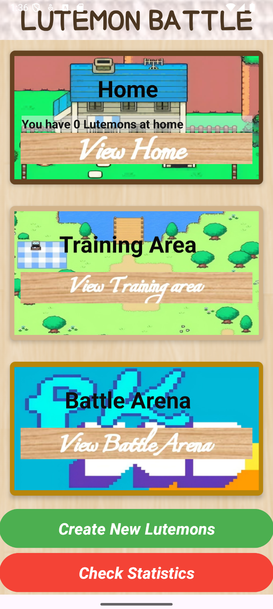
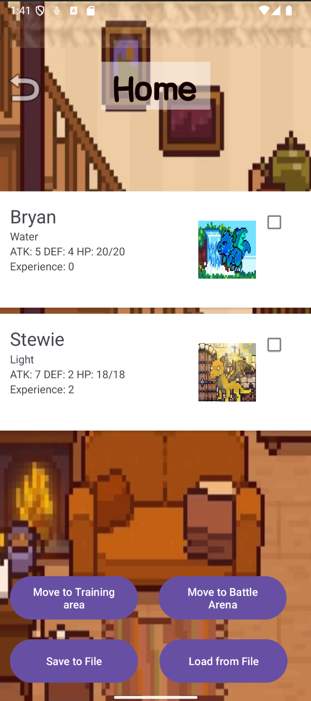
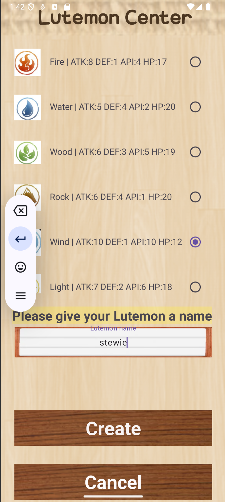
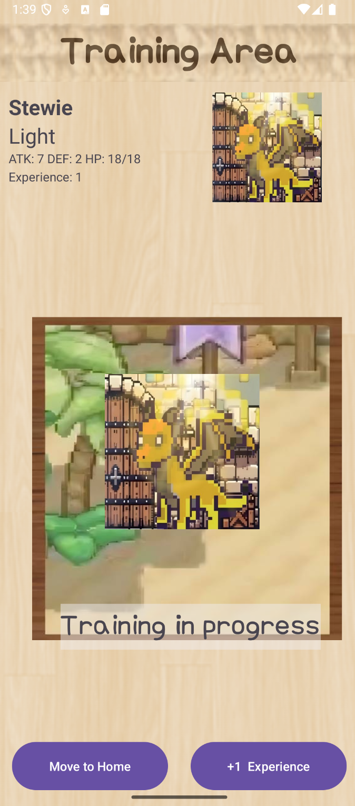
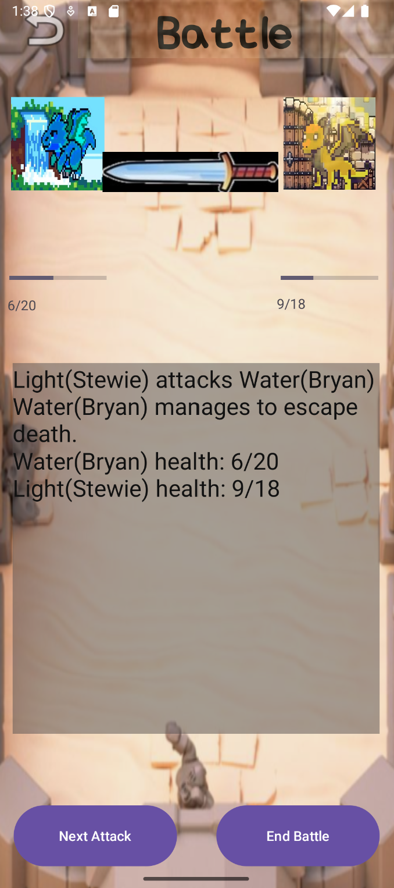
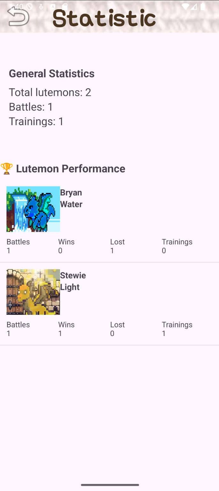

🎮 Lutemon Battle — Android Mini Game

Lutemon Battle is a small Android game developed for an object-oriented programming course.
Players can create different Lutemons, train them, and let them fight through a turn-based battle system.
The project demonstrates Android UI design, RecyclerView usage, data persistence, and custom game logic.

✨ Features (General Description)
✔ Lutemon Creation
Users can create new Lutemons through a dedicated creation UI.
The UI displays different attribute images for each Lutemon type.
(We used a separate AttributeOption class to provide these preview images.)
Input validation provides reminders when fields are missing or invalid.
All existing Lutemons are shown in a RecyclerView list.

✔ Training
From the Home page, users can choose one Lutemon to train each time.
Training increases its experience.
The training area displays the selected Lutemon and its stats.

✔ Battle System
Users select two Lutemons from the Home page to start a battle.
A turn-based system is used:
Each Lutemon attacks only when the player clicks “Attack”
The player can end the battle at any time
A custom speed attribute determines which Lutemon attacks first.
We added a random attack bonus for more dynamic gameplay.
Real-time HP is shown with text descriptions and health bars.
When the battle ends:
Winner gains +1 experience
Loser returns home, HP resets, and experience resets to 0

✔ Home Page
Displays all Lutemons with their stats in a RecyclerView.
Allows selecting Lutemons for:
Training
Battle
Built-in serialization storage allows saving and loading all Lutemon data.

✔ Statistics Page
Shows:
Total battles
Total training sessions
Total number of Lutemons
A RecyclerView displays each Lutemon’s personal record:
Battles
Wins
Losses
Training count

🛠️ Tech Stack
Java
Android Studio (AndroidX)
RecyclerView + Adapter
Serializable data persistence
Object-Oriented design (Inheritance, Singletons)

📱 Screenshots
Located in /screenshots/

    
 
    

😊 Thanks for using this program!
